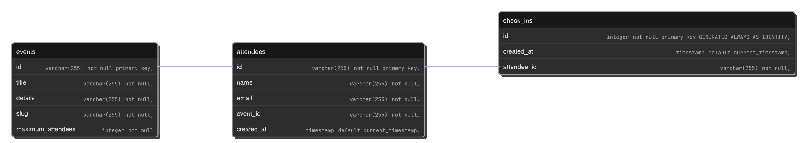

## 💻 Projeto

Essa API permite com que seja gerenciada as pessoas inscritas em um evento, permitindo com que seja criado o evento em si, adicionar um ou mais participantes e realizar o check In.

## 📀 Como rodar

Após abaixar o arquivo deverá ser adicionado no arquivo [application.properties](src/main/resources/application.properties) e preencher com o url da base de dados, usuário e senha para que posso ser feita o armazenamento dos dados assim como a realização das migrações pelo FlyWay, depois será apenas necessário executar a aplicação com o uso da IDE ou através do comando "mvn spring-boot:run" no diretório ROOT do projeto.

## 🧑‍⚖️ Regras

- Cada Usuário só poderá se inscrever uma vez em cada evento sendo o e-mail de uso único
- Cada cadastro do Usuário em um evento terá seu próprio ID
- Cada Evento terá um título único

## 🧾️ Modelo de entidade relacional

  

## 🚪 EndPoints da aplicação

Eventos(Events):

Metodos Get:
- /events/{eventId} -> Permite verificar os dados do Evento
- /events/attendees/{eventId} -> Fornece uma lista dos Participantes do Evento

Metodos Post:
- /events -> Permite criar um Evento
- /events/{eventId}/attendees -> Registra um Participante no Evento

Participantes(Attendee):

Metodos Get:
- /attendees/{attendeeId}/badge -> Fornece o estado da inscrição Participante através do seu id de inscrição em um Evento

Metodos Post:
- /{attendeeId}/check-in -> Marca o comparecimento do Participante no evento que ele se inscreveu através do id de inscrição

## 🔧 Tecnologias

Foi usado nesse projeto :

- [Maven](https://maven.apache.org/)
- [Spring Boot](https://spring.io/projects/spring-boot)

Dependências:
- [Hibernate](https://hibernate.org/orm/)
- [Spring Web](https://mvnrepository.com/artifact/org.springframework/spring-web)
- [Postgresql](https://www.postgresql.org/)
- [PostgreSQL Driver](https://jdbc.postgresql.org/download/)

Dependências para desenvolvimento:
- [Spring Boot DevTools](https://mvnrepository.com/artifact/org.springframework.boot/spring-boot-devtools)
- [Flyway](https://www.red-gate.com/products/flyway/community/)
- [Lombok](https://projectlombok.org/)
